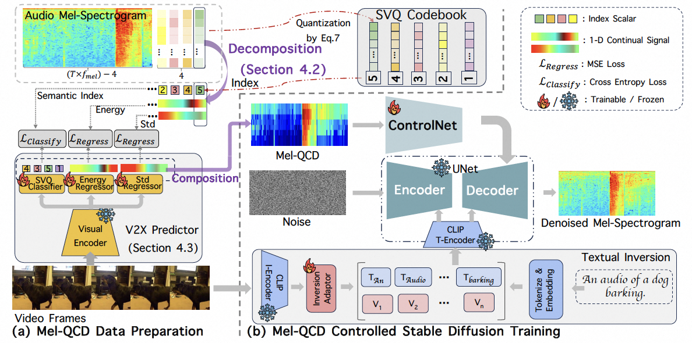

<div align="center">


<h1>Synchronized Video-to-Audio Generation via Mel Quantization-Continuum Decomposition</h1>

<div>
    <a target='_blank'>Juncheng Wang<sup>1,*</sup></a>&emsp;
    <a target='_blank'>Chao Xu<sup>2,*</sup></a>&emsp;
    <a target='_blank'>Cheng Yu<sup>2,*</sup></a>&emsp;
    <a target='_blank'>Lei Shang<sup>2,†</sup></a>&emsp;
    <a target='_blank'>Zhe Hu<sup>1,</sup></a>&emsp;
    <a target='_blank'>Shujun Wang<sup>1,‡</sup></a>&emsp;
    <a target='_blank'>Liefeng Bo<sup>2,‡</sup></a>
</div>
<div>
    <sup>1</sup>The Hong Kong Polytechnic University, <sup>2</sup>Tongyi Lab, Alibaba Group&emsp; 
</div>
<div>
* equal contribution, † project lead, ‡ corresponding author
</div>

[[paper]]()

---

</div>

#### 🚩Accepted by CVPR2025

## 🔥 News
- [2025.03] Release training code.
- [2025.03] Release inference code.
- [2025.03] This repo is created.


## 🎬 Overview



## 🔧 Dependencies and Installation

1. Clone repo
    ```bash
    git clone https://github.com/wjc2830/MelQCD.git
    cd MelQCD
    ```

2. Install dependent packages
    ```bash
    conda env create -f environment.yaml
    conda activate audio
    ```

3. Download Models 
    #### Dependent Models, trained on VGGSound
* [SyncFormer]()
* [V2X Signal Predictor]()
* [MelQCD]()

    Put checkpoints as follows:
```
├── pretrain
│   ├── config.json
│   ├── MelQCD.ckpt
│   ├── vocoder.pt
├── SyncFormer
│   ├── pretrain
│   │   └── SyncFormer.pt
└── CodePredictor
    └── pretrain
       └── CodePredictor.pt
```

## 🚀 Gradio Demo
You can launch the Gradio interface for MelQCD by running the following command:
```
python app.py
```

## ⚡ Quick Inference
Put your input video clips in `examples/video_clip`, the video length should not exceed 10 seconds. For text-based video to audio generation, please create a JSON file in the format `{file_name: prompt}`. For reference, you can check the example in `examples/text_info.json`.

### Video To Audio Generation

```
bash run_V2A.sh
```
### Text-based Video to Audio Generation
```
bash run_TV2A.sh
```
### Text-based Video to Audio Generation without Textual Inversion
```
bash run_TV2A_woTI.sh
```

## 🧠 Training 

### Train for V2X Signal Predictor
Before training, please prepare videos with audio or separated video and audio, such as the `video_clip` and `audio_clip` in the `examples`. Additionally, prepare `train.txt` and `test.txt`, which contain the training and testing data, respectively.
```
# extract visual features
cd SyncFormer
python gen_feat.py

# extract GT MelQCD
cd ../CodePredictor
python generate_mel.py --root ../examples
python generate_melqcd_gt.py --root ../examples
```
Tips: The released MelQCD (without Textual Inversion), although trained on vggsound, has some generalization ability. However, the V2X signal predictor has limited generalization ability. New data can be retrained as described above.

### Train for MelQCD
Coming soon

## 🎫 License
This project is released under the [Apache 2.0 license](LICENSE).

## 📧 Contact
If you have any questions, please feel free to contact: `jc2830.wang@connect.polyu.hk`


## 📚 Citations
```
```